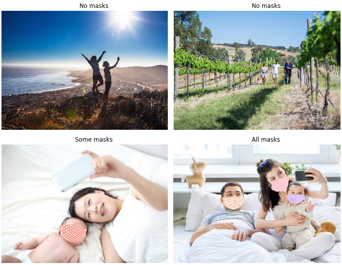
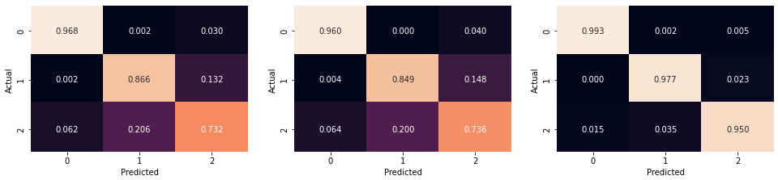
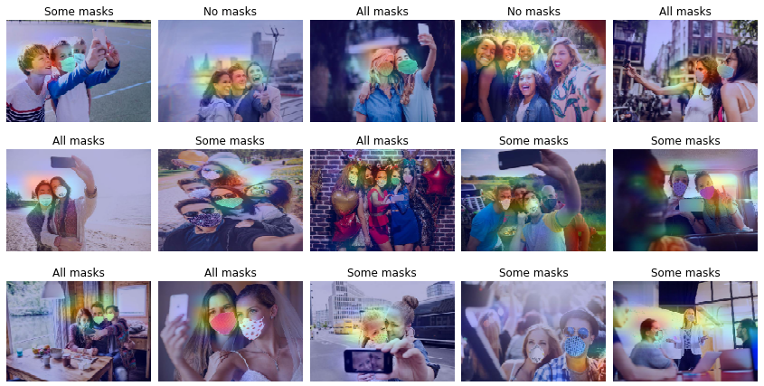

# **Face Mask CNN-Classifier with `TensorFlow` e `Keras`**

## 📖 **About**

The aim of this project is to build an automatic classifier that can recognize whether in a photo all the people are wearing masks, only some of them, or none at all. The dataset is available on [ kaggle](https://www.kaggle.com/competitions/artificial-neural-networks-and-deep-learning-2020). It is an artificial dataset (of about 5.614 images), so some images are particularly problematic (or, otherwise, funny), for example:

 
<i>In the first line there are problematic images.</i>

## 📝 **Approach and results**
Through the use of `TensorFlow` and `Keras`, I build an ensemble of convolutional neural networks for classification. 

First of all, `TensorFlow` offers three different options for reading the dataset as input, therefore, I initially decided to test the efficiency of the three options:
* `flow_from_directory`
* `flow_from_directory` and `Dataset.from_generator`
* `image_dataset_from_directory`

I created a convolutional neural network for each of the three options and compared the result. Obviously the three options affect the whole code and (as you can see below) the training results as well. While changing the way of importing the images, I have kept the structure of the neural network the same, so that I could make a fair comparison. In the notebooks [Face Mask 1](https://github.com/PaulinoMoskwa/FaceMask-CNN/blob/master/Notebooks/Face%20Mask%201%20-%20flow_from_directory.ipynb), [Face Mask 2](https://github.com/PaulinoMoskwa/FaceMask-CNN/blob/master/Notebooks/Face%20Mask%202%20-%20flow_from_directory%2C%20Dataset.from_generator.ipynb) and [Face Mask 3](https://github.com/PaulinoMoskwa/FaceMask-CNN/blob/master/Notebooks/Face%20Mask%203%20-%20image_dataset_from_directory.ipynb) are shown all the details. 

The three notebooks are structured in the same way:
* Import of the dataset 
* Dataset exploration and classes analysis
* Base model definition (via [`Keras`](https://keras.io/api/applications/))
* Compile and train of the model
* Model performance evaluation
* Prediction
* GradCAM

### 🔎 **Import of the dataset**
The method by which the dataset is imported also affects the definition of the loss function, since it changes the encoding of the labels. In the case of `flow_from_directory` the labels are one-hot-encoded (e.g. for a 3-class classification the labels are: `[1,0,0]` , `[0,1,0]`, `[0,0,1]`) and this requires the loss function to be `CategoricalCrossentropy()`. By contrast, in the case of `image_dataset_from_directory`, the labels are encoded as integers (e.g. for a 3-class classifications the labels are: `[1]` , `[2]`, `[3]`) and this requires the loss function to be `SparseCategoricalCrossentropy()`.

### 🔎 **Classes analysis**
An important factor to consider when it comes to classification is the balance of the classes. In this case the three classes (*all masks*, *no masks*, *some masks*) are adequately balanced among each other. 

### 🔎 **Model performance evaluation**
To figure out which of the three approaches is the most efficient, I relied on several elements.

#### **1. Accuracy**

<table align="center">
    <tr>
        <th>
   Import Option 
</th>
        <th>
 Train Accuracy 
</th>
        <th>
 Validation Accuracy 
</th>
    </tr>
    <tr>
        <td>
<code> flow_from_directory </code>
</td>
        <td>
 0.9913 
</td>
        <td>
 0.8575 
</td>
    </tr>
    <tr>
        <td>
<code> flow_from_directory </code>, <code> Dataset.from_generator</code>
</td>
        <td>
 0.9906 
</td>
        <td>
 0.8498 
</td>
    </tr>
    <tr>
        <td>
<code> image_dataset_from_directory </code>
</td>
        <td>
 0.9995 
</td>
        <td>
 0.9133 
</td>
    </tr>
</table>

The third option proved to be the most efficient not only because of the highest validation accuracy value, but also because of the smallest gap between train and validation accuracy. 

#### **2. Confusion matrix**
From left to right: `flow_from_directory`, `flow_from_directory` and `Dataset.from_generator`, `image_dataset_from_directory`:

Also with this evaluation criterion, the third option turned out to be the best.

#### **3. Quantitative indeces**
*Version*: Micro 
It calculates metrics globally by counting the total true positives, false negatives and false positives.

<table align="center">
    <tr>
        <th>
   Import Option 
</th>
        <th>
 Precision 
</th>
        <th>
 Recall 
</th>
        <th>
 Accuracy 
</th>
        <th>
 F1 
</th>
    </tr>
    <tr>
        <td>
<code> flow_from_directory </code>
</td>
        <td>
 0.85748 
</td>
        <td>
 0.85748 
</td>
        <td>
 0.85748 
</td>
        <td>
 0.85748 
</td>
    </tr>
    <tr>
        <td>
<code> flow_from_directory </code>, <code> Dataset.from_generator</code>
</td>
        <td>
 0.84976 
</td>
        <td>
 0.84976 
</td>
        <td>
 0.84976 
</td>
        <td>
 0.84976 
</td>
    </tr>
    <tr>
        <td>
<code> image_dataset_from_directory </code>
</td>
        <td>
 0.97387 
</td>
        <td>
 0.97387 
</td>
        <td>
 0.97387 
</td>
        <td>
 0.97387 
</td>
    </tr>
</table>

*Version*: Macro 
It calculates metrics for each label, and finds their unweighted mean. This does not take label imbalance into account.

<table align="center">
    <tr>
        <th>
   Import Option 
</th>
        <th>
 Precision 
</th>
        <th>
 Recall 
</th>
        <th>
 Accuracy 
</th>
        <th>
 F1 
</th>
    </tr>
    <tr>
        <td>
<code> flow_from_directory </code>
</td>
        <td>
 0.85551 
</td>
        <td>
 0.85565 
</td>
        <td>
 0.85748 
</td>
        <td>
 0.85454 
</td>
    </tr>
    <tr>
        <td>
<code> flow_from_directory </code>, <code> Dataset.from_generator</code>
</td>
        <td>
 0.84730 
</td>
        <td>
 0.84810 
</td>
        <td>
 0.84976 
</td>
        <td>
 0.84723 
</td>
    </tr>
    <tr>
        <td>
<code> image_dataset_from_directory </code>
</td>
        <td>
 0.97375 
</td>
        <td>
 0.97348 
</td>
        <td>
 0.97387 
</td>
        <td>
 0.97356 
</td>
    </tr>
</table>

*Version*: Weighted 
It calculates metrics for each label, and finds their average weighted by the number of true instances for each label. This alters 'macro' to account for label imbalance.

<table align="center">
    <tr>
        <th>
   Import Option 
</th>
        <th>
 Precision 
</th>
        <th>
 Recall 
</th>
        <th>
 Accuracy 
</th>
        <th>
 F1 
</th>
    </tr>
    <tr>
        <td>
<code> flow_from_directory </code>
</td>
        <td>
 0.85617 
</td>
        <td>
 0.85748 
</td>
        <td>
 0.85748 
</td>
        <td>
 0.85580 
</td>
    </tr>
    <tr>
        <td>
<code> flow_from_directory </code>, <code> Dataset.from_generator</code>
</td>
        <td>
 0.84818 
</td>
        <td>
 0.84976 
</td>
        <td>
 0.84976 
</td>
        <td>
 0.84851 
</td>
    </tr>
    <tr>
        <td>
<code> image_dataset_from_directory </code>
</td>
        <td>
 0.97385 
</td>
        <td>
 0.97387 
</td>
        <td>
 0.97387 
</td>
        <td>
 0.97381 
</td>
    </tr>
</table>

In all cases and in all indices, the third option prevails.

### 🔎 **GradCAM**
This section was not actually introduced for the purpose of adding anything to the comparison between the three methods of importing images. Instead, it was included as a matter of 'Explainable AI'. As good as a model can be as a classifier, it is necessary that its decisions be justified in some way. Through the introduction of GradCAM, it is possible to understand which section of the photo the model focused on to make its prediction. 

 
<i>The more red an area is, the more it was considered during the final prediction.</i>

 

 
<i>Predictions with the most important areas for each image.</i>

---------------------

Once the first part of the work was completed, I moved onto creating the ensemble. Using the third option as the method for importing the images (`image_dataset_from_directory`), I trained seven models independently of each other. The results are reported in the notebook [Ensemble 1 - Training](https://github.com/PaulinoMoskwa/FaceMask-CNN/blob/master/Notebooks/Ensemble%201%20-%20Training.ipynb) and also in the table:

<table align="center">
    <tr>
        <th>
   Base Model 
</th>
        <th>
 Train Accuracy 
</th>
        <th>
 Validation Accuracy 
</th>
    </tr>
    <tr>
        <td>
   EfficientNetB3 
</td>
        <td>
 0.9916 
</td>
        <td style="background-color:green;color:white;">
 0.9305 
</td>
    </tr>
    <tr>
        <td>
   Xception 
</td>
        <td style="background-color:red;color:white;">
 0.8858 
</td>
        <td style="background-color:red;color:white;">
 0.7844 
</td>
    </tr>
    <tr>
        <td>
   ResNet50V2 
</td>
        <td>
 0.9529 
</td>
        <td>
 0.8325 
</td>
    </tr>
    <tr>
        <td>
   InceptionV3 
</td>
        <td style="background-color:green;color:white;">
 0.9977 
</td>
        <td>
 0.8931 
</td>
    </tr>
    <tr>
        <td>
   InceptionResNetV2 
</td>
        <td>
 0.9944 
</td>
        <td>
 0.8996 
</td>
    </tr>
    <tr>
        <td>
   DenseNet201 
</td>
        <td>
 0.9399 
</td>
        <td>
 0.8901 
</td>
    </tr>
    <tr>
        <td>
   EfficientNetV2S 
</td>
        <td>
 0.9702 
</td>
        <td>
 0.8967 
</td>
    </tr>
</table>

From these seven neural networks I created a model that, taking an image as input, returns as a class the one that was predicted the most times among the seven networks. The results are reported in the notebook [Ensemble 2 - Prediction](https://github.com/PaulinoMoskwa/FaceMask-CNN/blob/master/Notebooks/Ensemble%202%20-%20Prediction.ipynb).
